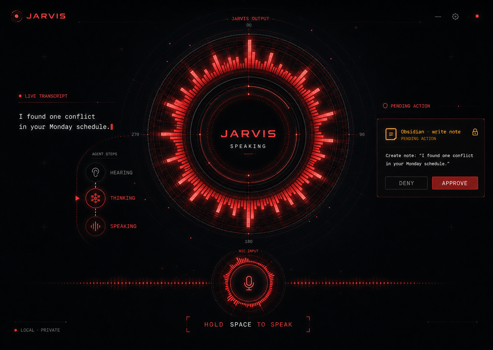

# Astrono Jarvis

A voice-first, locally operated AI command console built on
[OpenJarvis](https://github.com/open-jarvis/OpenJarvis).



Astrono Jarvis combines a Gemma 4 agent brain hosted through NVIDIA NIM, OpenAI's
open-source Whisper speech
recognition, high-quality ElevenLabs speech, a local Kokoro voice fallback, and
confirmation-gated MCP tools in one desktop-ready interface.

## What is implemented

- Hold-to-talk microphone capture with `Space` or the on-screen control.
- Local transcription through the official
  [openai/whisper](https://github.com/openai/whisper) repository.
- Always-on local "Hey Jarvis" activation through openWakeWord's pretrained
  ONNX model, with no wake-word API key or usage fee.
- Acoustic echo cancellation plus hard wake-listener gating while JARVIS is
  listening, thinking, or speaking, preventing self-reactivation.
- Automatic silence handoff through a dedicated 16 kHz PCM Silero VAD stream,
  with raw probability, input-level, and elapsed-silence diagnostics. Hold-Space
  and microphone push-to-talk remain deterministic fallbacks.
- Live hearing and thinking timers synchronized through backend WebSocket state
  transitions.
- A full-screen React Three Fiber astronomy interface:
  - persistent depth-aware starfield;
  - separate live microphone spectrum bar;
  - shader-driven black-hole and solar-system modes;
  - thinking-speed animation and speech-reactive jets or solar flares.
- Streaming OpenJarvis agent and tool events.
- Immediate ElevenLabs audio streaming to browser playback when configured.
- ElevenLabs voice selection tuned toward a calm, articulate British
  AI-assistant character.
- Automatic local Kokoro TTS fallback when ElevenLabs is unavailable.
- MCP tool safety classification: read operations can run directly; browser,
  filesystem, note, and other write-like operations require confirmation.
- A live approval queue with approve and deny actions.
- Typed-command fallback and a responsive monochrome astronomical console.

The ElevenLabs profile is intentionally an original, JARVIS-inspired delivery.
It does not clone or claim to reproduce a film actor's voice.

## Requirements

- Windows 10/11, macOS, or Linux
- Python 3.10–3.13
- Node.js 20+
- [uv](https://docs.astral.sh/uv/)
- An NVIDIA API key for the configured hosted Gemma 4 agent brain
- No system FFmpeg install is required; the speech extra installs a
  project-local FFmpeg binary through `imageio-ffmpeg`.

An NVIDIA GPU is optional. Whisper uses CUDA when available and otherwise runs
on CPU.

## Setup

```powershell
git clone https://github.com/jcb1515/Jarvis.git
cd Jarvis
uv sync --extra desktop
Copy-Item .env.example .env
Copy-Item configs/jarvis-assistant.toml "$HOME/.openjarvis/config.toml"
cd frontend
npm install
```

`uv sync --extra desktop` installs Whisper directly from the pinned official
GitHub revision in `pyproject.toml`, along with a project-local FFmpeg runtime
for WAV, MP3, and browser WebM decoding. No transcription API key or per-minute
fee is required. The configured Whisper model is downloaded once on first use
and cached locally.

Edit `.env` and add your NVIDIA key. Add ElevenLabs if you want the primary
cloud voice:

```dotenv
NVIDIA_API_KEY=your_nvidia_key_here
ELEVENLABS_API_KEY=your_key_here
# Optional: force a voice from ElevenLabs "My Voices".
ELEVENLABS_VOICE_ID=
```

Without an ElevenLabs key, speech synthesis uses the local Kokoro backend.
The configured model ID is `nvidia/google/gemma-4-31b-it`; the prefix selects
NVIDIA's OpenAI-compatible NIM endpoint, while the upstream model ID sent to
NVIDIA remains `google/gemma-4-31b-it`.

The sample MCP list connects directly to Obsidian Local REST API's built-in
MCP endpoint. Its default HTTPS endpoint uses a self-signed certificate, so
TLS verification is disabled only for this loopback connection. Set the three
`OBSIDIAN_*` values before starting JARVIS.

## Run

Start the local backend from the repository root:

```powershell
$env:OPENJARVIS_CONFIG="$PWD/configs/jarvis-assistant.toml"
uv run --env-file .env jarvis serve
```

In another terminal:

```powershell
cd frontend
npm run dev
```

On Windows, the project launcher starts both services in hidden processes and
opens the interface in regular Google Chrome:

```powershell
.\scripts\start-local.ps1
```

Open `http://localhost:5173` and allow microphone access. The first connection
downloads and caches openWakeWord's pretrained "Hey Jarvis" model. Once the
header reads `WAKE ARMED`, say "Hey Jarvis", wait for the cue, speak naturally,
and pause; Silero VAD finalizes the command automatically.

Hold `Space` or hold the `MANUAL FALLBACK` control when ambient sound makes the
wake phrase unreliable. You can also type a command in the bottom field.

The first Whisper transcription can take longer because the selected model must
be downloaded and loaded. Change `speech.model` in the config:

| Model | Relative speed | Relative accuracy |
| --- | --- | --- |
| `tiny` | Fastest | Basic |
| `base` | Fast | Good default |
| `small` | Moderate | Better |
| `medium` | Slow | High |
| `turbo` | GPU-oriented | High |

## Voice character

When `ELEVENLABS_VOICE_ID` is blank, the backend lists the voices available to
your account and ranks them for qualities such as British, baritone,
articulate, crisp, calm, and professional. It then applies a stable, deliberate
delivery profile. To select a voice manually, copy its ID from ElevenLabs
**My Voices** and set `ELEVENLABS_VOICE_ID`.

## MCP tools and approvals

The sample config includes Playwright and Obsidian MCP server definitions.
Every server may specify:

- `read_only_tools`: explicit tools that can execute immediately;
- `write_tools`: explicit tools that always require confirmation;
- `default_mode`: use `confirm` for unknown tools.

Tool-name classification adds a second safety layer. Names containing operations
such as `create`, `delete`, `click`, `fill`, `send`, or `write` are treated as
writes. Playwright navigation, page reading, snapshots, console inspection, and
network inspection are explicitly read-only. Unknown tools default to
confirmation.

The Obsidian entry expects Local REST API at
`https://127.0.0.1:27124/mcp/`. Set its bearer key in `.env` before starting
JARVIS. Read operations such as vault listing and search run directly; note
creation, edits, deletes, moves, commands, and UI-opening actions require
confirmation. If you do not use Obsidian, set that server object's `enabled`
field to `false`.

## Configuration

The main project configuration is
[`configs/jarvis-assistant.toml`](configs/jarvis-assistant.toml). The assistant
persona is in [`prompts/jarvis-system.md`](prompts/jarvis-system.md).

Important values:

```toml
[intelligence]
default_model = "nvidia/google/gemma-4-31b-it"
preferred_engine = "cloud"
provider = "nvidia"

[speech]
backend = "whisper"
model = "base"
device = "auto"
tts_backend = "auto"
tts_speed = 0.92
auto_speak = true
wake_word_enabled = true
wake_word_model = "hey jarvis"
wake_word_threshold = 0.5
wake_word_vad_threshold = 0.35
vad_threshold = 0.5
vad_min_speech_ms = 96
vad_min_silence_ms = 1000
```

## Validation

```powershell
uv run ruff check src/openjarvis
uv run pytest tests/speech tests/mcp/test_safety.py tests/tools/test_mcp_adapter.py
cd frontend
npm run build
npm test
```

To inspect the detector without Whisper, the agent, or TTS, run the standalone
diagnostic against any supported audio file:

```powershell
uv run python scripts/diagnose_vad.py path\to\speech.wav
```

It prints every raw Silero probability, RMS input level, speech state, elapsed
trailing silence, and the exact frame where the one-second stop condition is
reached.

## Security and privacy

- Whisper transcription stays on the machine.
- Wake-word audio stays on the machine and is processed by openWakeWord through
  ONNX Runtime. Continuous microphone audio is not sent to NVIDIA or
  ElevenLabs.
- Ollama/local-model prompts stay on the machine.
- Text sent to ElevenLabs leaves the machine when that backend is enabled.
- MCP write-like tools are confirmation-gated.
- Never commit `.env`, API keys, local model files, recordings, or approval
  databases.

## Project foundation and license

This project builds on
[OpenJarvis](https://github.com/open-jarvis/OpenJarvis) and retains its Apache
2.0 license. OpenAI Whisper is installed from its official repository and is
licensed separately under MIT. Review third-party service terms before
commercial use, especially ElevenLabs voice and output licensing.
